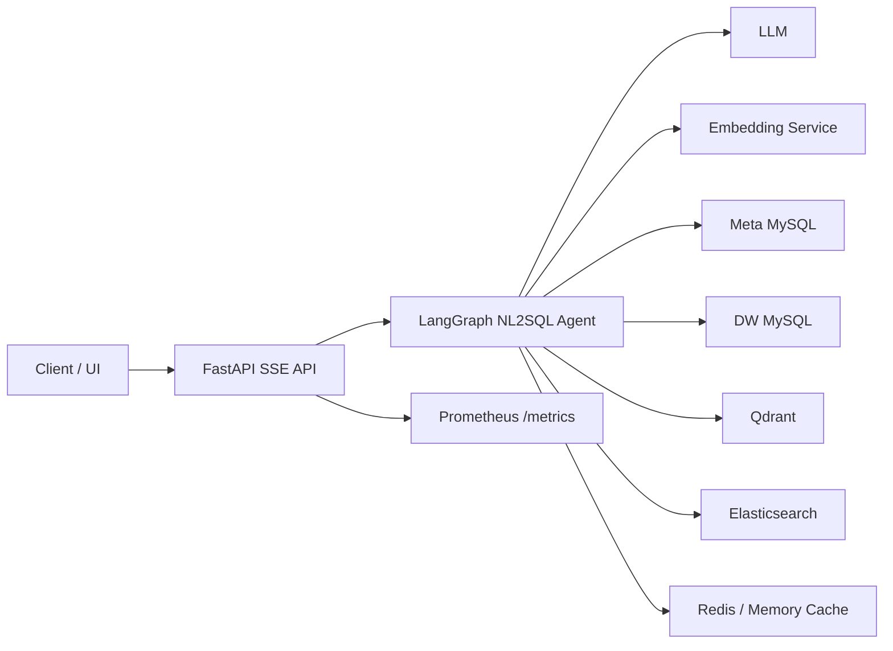
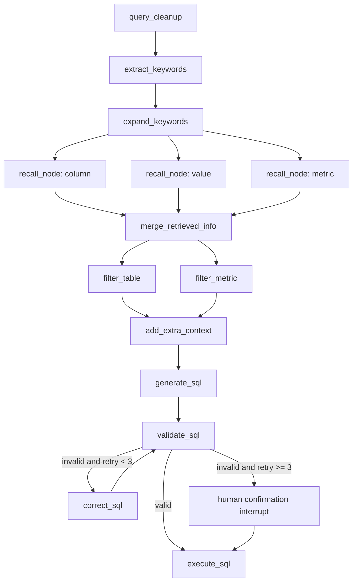

# Agent NL2SQL

面向中文数据分析场景的 NL2SQL 智能查询服务。项目基于 FastAPI、LangGraph、MySQL、Qdrant、Elasticsearch、Redis 和大模型能力，将自然语言问题转换为可执行 SQL，并通过流式接口返回生成、校验、执行和人机确认过程。

## 项目简介

Agent NL2SQL 的目标是把业务用户的自然语言问题转换为结构化 SQL 查询结果。系统会先清洗问题、提取和扩展关键词，再并行召回字段、指标和值域信息，随后筛选上下文、生成 SQL、校验 SQL，并在必要时自动修正。若 SQL 连续校验失败达到上限，服务会触发人机确认中断，由调用方决定是否继续执行。

仓库当前已完成生产级缓存改造：Redis 作为优先缓存后端，内存缓存作为开发环境或 Redis 不可用时的 fallback；缓存 key 按租户、用户、项目隔离；SQL 生成支持可选 Semantic Redis Cache；同时暴露 Prometheus `/metrics` 指标，方便观察缓存命中、过期和淘汰情况。

## GitHub Description

```text
Production-ready Chinese NL2SQL agent with FastAPI, LangGraph, Redis/Semantic Cache, Qdrant, Elasticsearch, PostgreSQL checkpoints, and Prometheus metrics.
```

## 核心能力

- 自然语言转 SQL：支持中文问题清洗、关键词抽取、上下文召回、SQL 生成、SQL 校验与修正。
- LangGraph 工作流：用图编排 NL2SQL 流程，支持 checkpoint 与中断恢复。
- 多路召回：字段和指标使用 Qdrant 向量检索，枚举值使用 Elasticsearch 检索，元数据来自 MySQL。
- SQL 安全校验：校验失败时进入修正循环，连续失败后触发人机确认，而不是每次执行前都打断。
- 生产级缓存：Redis 优先、内存 fallback，支持 TTL、stale fallback、Semantic SQL cache、版本化 key、按租户/用户/项目隔离。
- 可观测性：通过 Prometheus 格式的 `/metrics` 暴露缓存请求、命中率、过期率、淘汰率和后端可用性。
- 本地基础设施：提供 Docker Compose 启动 MySQL、Elasticsearch、Kibana、Qdrant、Redis 和 Embedding 服务。
- 测试覆盖：包含缓存、SQL 校验、SQL 执行、熔断等关键行为测试。

## 架构概览



## NL2SQL 流程



## 技术栈

- Python 3.12+
- FastAPI
- LangGraph / LangChain
- MySQL / SQLAlchemy / asyncmy
- Qdrant
- Elasticsearch 8
- Redis
- HuggingFace Text Embeddings Inference
- Prometheus Client
- pytest / pytest-asyncio
- uv

## 目录结构

```text
app/
  agent/                 LangGraph 工作流、状态、节点、checkpoint
  api/                   FastAPI 路由、请求 schema、依赖注入
  clients/               MySQL、Qdrant、ES、Embedding 客户端管理
  conf/                  应用配置加载与配置 dataclass
  core/                  缓存、熔断、重试、日志、生命周期
  entities/              业务实体
  models/                MySQL ORM 模型
  prompt/                Prompt 加载器
  repositories/          MySQL / Qdrant / Elasticsearch 仓储
  scripts/               元数据知识库构建脚本
  services/              查询服务与元数据知识库构建服务
conf/                    应用配置与元数据构建配置
docker_nl2sql/           本地依赖服务 Docker Compose 与初始化 SQL
eval/                    评测与压测脚本
prompts/                 各流程节点 Prompt 模板
tests/                   单元测试与回归测试
```

## 快速开始

### 1. 安装依赖

```bash
uv sync
```

### 2. 准备环境变量

复制示例配置：

```bash
cp .env.example .env
```

然后在 `.env` 中填写数据库密码、LLM API Key、服务地址等本地配置。`.env` 已被 git 忽略，不应提交真实密钥。

### 3. 启动本地依赖服务

```bash
cd docker_nl2sql
docker compose up -d
```

默认包含：

- MySQL: `localhost:3306`
- Elasticsearch: `localhost:9200`
- Kibana: `localhost:5601`
- Qdrant: `localhost:6333`
- Redis: `localhost:6379`
- Embedding: `localhost:8081`

Embedding 服务默认挂载 `docker_nl2sql/embedding/bge-large-zh-v1.5`，需要提前准备对应模型文件。

### 4. 构建元数据知识库

在项目根目录执行：

```bash
uv run python -m app.scripts.build_meta_knowledge -c conf/meta_config.yaml
```

构建完成后会刷新相关缓存 namespace，包括元数据、向量召回、ES 值召回和 SQL 生成缓存。

### 5. 启动 API 服务

```bash
uv run fastapi dev main.py --host 0.0.0.0 --port 8080
```

或：

```bash
uv run python main.py
```

## API

### 发起查询

```http
POST /api/query
Content-Type: application/json
```

```json
{
  "query": "统计浙江的销售总额",
  "session_id": "optional-session-id",
  "tenant_id": "tenant-a",
  "user_id": "user-a",
  "project_id": "project-a"
}
```

响应类型为 `text/event-stream`。`tenant_id`、`user_id`、`project_id` 均为可选字段，未传时使用默认 scope，兼容旧客户端。

### 恢复中断

```http
POST /api/query/resume
Content-Type: application/json
```

```json
{
  "session_id": "existing-session-id",
  "confirmed": true,
  "tenant_id": "tenant-a",
  "user_id": "user-a",
  "project_id": "project-a"
}
```

当 SQL 连续校验失败并触发人机确认中断后，可通过该接口恢复流程。

### 监控指标

```http
GET /metrics
```

返回 Prometheus text format。当前缓存指标包括：

- `nl2sql_cache_requests_total{cache,result}`
- `nl2sql_cache_sets_total{cache}`
- `nl2sql_cache_evictions_total{cache}`
- `nl2sql_cache_hit_ratio{cache}`
- `nl2sql_cache_expired_ratio{cache}`
- `nl2sql_cache_eviction_ratio{cache}`
- `nl2sql_cache_backend_up{backend}`

指标 label 控制为低基数，只包含 `cache`、`result`、`backend`，不包含租户、用户、项目字段。

## 缓存策略

缓存配置位于 `conf/app_config.yaml`，可通过环境变量覆盖：

```env
CACHE_BACKEND=redis
CACHE_ENV=dev
CACHE_KEY_PREFIX=nl2sql
CACHE_FAIL_FAST=false
CACHE_STALE_TTL_SECONDS=1800
CACHE_SEMANTIC_ENABLED=true
CACHE_SEMANTIC_THRESHOLD=0.94
CACHE_SEMANTIC_MAX_ENTRIES=1024
CACHE_SEMANTIC_TTL_SECONDS=7200
CACHE_TTL_EMBEDDING_SECONDS=86400
CACHE_TTL_LLM_CLEANUP_SECONDS=7200
CACHE_TTL_LLM_EXPAND_SECONDS=7200
CACHE_TTL_QDRANT_COLUMN_SECONDS=3600
CACHE_TTL_QDRANT_METRIC_SECONDS=3600
CACHE_TTL_ES_VALUE_SECONDS=3600
CACHE_TTL_GENERATE_SQL_SECONDS=7200
CACHE_TTL_META_MYSQL_SECONDS=7200
PROMPT_VERSION=v1
SCHEMA_VERSION=v1
EMBEDDING_MODEL_VERSION=bge-large-zh-v1.5
INDEX_VERSION=v1
REDIS_HOST=localhost
REDIS_PORT=6379
REDIS_DB=0
REDIS_PASSWORD=
PROMETHEUS_ENABLED=true
```

缓存 key 格式：

```text
nl2sql:{env}:{tenant_id}:{user_id}:{project_id}:{cache_name}:{version}:{hash}
```

默认 scope：

```text
tenant_id=default_tenant
user_id=default_user
project_id=default_project
```

语义缓存：

- `CACHE_SEMANTIC_ENABLED=true` 后，`generate_sql` 会先查精确缓存，再用 query embedding 查询 `semantic_generate_sql`。
- 语义缓存只在相同 tenant/user/project、相同上下文 fingerprint、相同 prompt/schema version 下生效。
- 命中条件由 `CACHE_SEMANTIC_THRESHOLD` 控制，默认 0.94，建议生产环境先观察评测集后再调低。
- `CACHE_SEMANTIC_MAX_ENTRIES` 控制每个上下文 namespace 中保留的语义样本数。
- 语义命中后会反写当前问题的精确 SQL 缓存，后续相同请求走普通精确缓存。

建议生产环境设置：

```env
CACHE_BACKEND=redis
CACHE_FAIL_FAST=true
CACHE_ENV=prod
CACHE_SEMANTIC_ENABLED=true
CACHE_SEMANTIC_THRESHOLD=0.94
CACHE_SEMANTIC_TTL_SECONDS=7200
CACHE_STALE_TTL_SECONDS=1800
CACHE_TTL_QDRANT_COLUMN_SECONDS=3600
CACHE_TTL_QDRANT_METRIC_SECONDS=3600
CACHE_TTL_ES_VALUE_SECONDS=3600
CACHE_TTL_GENERATE_SQL_SECONDS=7200
```

## 测试

运行全部测试：

```bash
uv run pytest -q
```

当前测试覆盖：

- Memory cache 命中、未命中、过期、淘汰、stale fallback
- Redis 不可用时 fallback 与 fail-fast
- 多租户缓存 key 隔离
- Semantic SQL cache 的阈值命中、scope 隔离、上下文隔离、容量淘汰和 namespace 清理
- 版本变更后的缓存隔离
- Prometheus 指标导出
- SQL 校验、执行与熔断相关行为

## 评测与压测

`eval/` 目录保留一个收敛后的并发评测入口，用 50 条专用样本验证 NL2SQL 在并发场景下的核心表现。默认关注 5 个指标：

- `result_accuracy`：SQL 执行结果与期望结果是否一致。
- `sql_execution_rate`：生成 SQL 是否可执行。
- `p50_latency_s`：并发场景中位延迟。
- `p95_latency_s`：并发场景尾延迟。
- `throughput_qps`：端到端吞吐量。

运行示例：

```bash
uv run python eval/run_benchmark.py --concurrency 5
uv run python eval/run_benchmark.py --concurrency 10 --limit 20
uv run python eval/run_benchmark.py --validate-only
uv run python eval/run_benchmark.py --concurrency 5 --langsmith-dataset nl2sql-benchmark
```

Semantic SQL cache 专用测试集位于 `eval/semantic_cache_cases.yaml`，包含 10 个完全不同语义簇，每簇 10 条语义相近但表达不同的问题。该数据集刻意让同簇样本共享同一条 `expected_sql`，运行时需要允许重复期望 SQL：

```bash
uv run python eval/run_benchmark.py --cases eval/semantic_cache_cases.yaml --allow-duplicate-expected-sql --concurrency 5
```

输出文件：

- `eval/reports/benchmark_YYYYMMDD_HHMMSS.log`：运行日志。
- `eval/reports/benchmark_samples_YYYYMMDD_HHMMSS.jsonl`：样本级指标、实际 SQL、实际结果和期望结果。
- `eval/reports/benchmark_report_YYYYMMDD_HHMMSS.md`：汇总报告和失败样本对比。

## Recall Guard

Qdrant 字段/指标召回和 Elasticsearch 枚举值召回都带有可配置阈值。低于阈值的候选不会进入后续上下文；如果三路召回都为空，流程会直接返回“当前查询内容在数据库中没有可用的相关字段、指标或枚举值”，不再生成 SQL。

```env
RECALL_COLUMN_SCORE_THRESHOLD=0.7
RECALL_METRIC_SCORE_THRESHOLD=0.7
RECALL_VALUE_SCORE_THRESHOLD=1.0
```

## 安全与工程约定

- 不提交 `.env`、真实 API Key、数据库密码或模型权重。
- `.env.example` 只保留空值和示例配置。
- 缓存 scope 来自请求体，后续接入认证系统后可从 header 或 auth claims 覆盖。
- `session_id` 只用于 LangGraph checkpoint，不再承担缓存隔离职责。
- Prometheus label 不包含租户、用户、项目，避免高基数监控风险。

## 当前状态

项目当前已完成基础 NL2SQL 工作流、SQL 校验与中断恢复、工程配置加固、生产级缓存策略、Semantic Redis Cache、Prometheus 监控接入和关键测试覆盖。后续可以继续补强认证鉴权、租户级限流、结构化日志、CI/CD 和在线评测报表。
